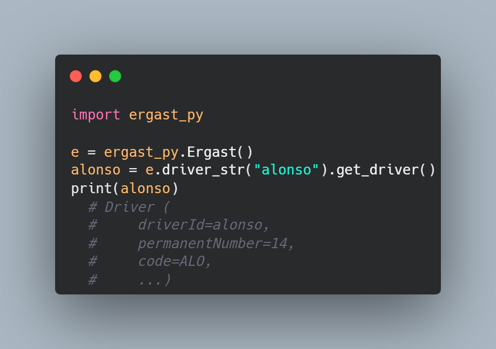

<h1 align="center"><b>Ergast-Py</b></h1>

<p align="center">
    
    
    
    <br>
    
    
    
</p>

A comprehensive Python wrapper for the Ergast API. Built for easy use and functionality, Ergast-py aims to bring the Ergast API into the Python network as seemlessly as possible.

> NOTE: Ergast-py will be wrapping up development this year. This is due to the Ergast API being currently deprecated, and shutdown at EOY 2024. For more information, read the Ergast [website](https://ergast.com/mrd/). Thanks for all the support.

<p align="center">
   
</p>

# What is Ergast?

[Ergast](http://ergast.com/mrd/) is a free, experimental API for accessing motor-racing data, dating back to the beginning of World Championships in 1950. The website provides plenty of detail into how effective the API can be, and the many options that are available for data gathering using it.

# Why should I use Ergast-Py?

Ergast-Py provides a clean, Python orientated wrapper for this API. It has been designed to remove the heavy lifting of handling the API formatting behind the scenes, allowing developers to easily access the data that is relevant to them. All the data is conformed into clean class code, allowing for users to keep a Python-centric mindset whilst developing.

# How to install

Ergast-py is a [pip package](https://pypi.org/project/ergast-py/), so can be installed with the pip command:

```
pip install ergast-py
```

# Usage

Once ergast-py is installed on your system you can then begin using the library in querying the ergast API. To begin, initialise an instance of the ``Ergast()`` class.

Note: Whilst the package is called ``ergast-py``, you need to import ``ergast_py``

```python
import ergast_py

e = ergast_py.Ergast()
```

Queries can then be built up with function calls in a sequential manner. Once you've built up a query, finally define what data you wish to get using a ``get_xyz()`` function.

```python
# http://ergast.com/api/f1/2008/5/results
race_results = e.season(2008).round(5).get_results()

# http://ergast.com/api/f1/drivers/massa
felipe_massa = e.driver("massa").get_driver()

# http://ergast.com/api/f1/current/constructorStandings/3
constructor_standings = e.season().standing(3).get_constructor_standings()
```

# Structure and Types

Ergast-py has many models which allow the user to more effectively use and manipulate the data available to them through Ergast. All models of data are available through ``.models.xyz``.

<details>
<summary>Available models in ergast-py</summary>
<br>

| Name                | Description                                            |
|---------------------|--------------------------------------------------------|
| AverageSpeed        | The average speed achieved during a fastest lap        |
| Circuit             | Details about a Formula One circuit                    |
| ConstructorStanding | A single constructor's representation in the standings |
| Constructor         | A Formula One constructor                              |
| DriverStanding      | A single driver's representation in the standings      |
| Driver              | A Formula One driver                                   |
| FastestLap          | A fastest lap achieved by a driver                     |
| Lap                 | Details about a drivers lap                            |
| Location            | The position of a circuit                              |
| PitStop             | Details about a driver's pit stop                      |
| Race                | Full representation of a Formula One race              |
| Result              | Details about a driver's result                        |
| Season              | Details about a Formula One season                     |
| StandingsList       | A list of standings; constructors or drivers           |
| Status              | Details about the final status of a driver in a race   |
| Timing              | Details about the timings of a driver during a lap     |

</details>

# Query building

There are 3 types of query available in the ``Ergast()`` class. <b>FILTER</b> functions build up the query, by filtering down the data that you will receive. <b>PAGING</b> functions control the flow of data if there is excessive amounts, limiting it to not overflow the API. <b>RETURN</b> functions detail what type of data you're expecting back from the query.

The order of the builder functions is inconsequential, however the final function called should be a <i>return</i> function.
```
Ergast().{paging/filter}.{return}
```

More detail on the available functions within the ``Ergast()`` class is available below.

<details>
<summary><b>FILTER</b> functions</summary>
<br>

| Name        | Arguments                | Notes                                                                      |
|-------------|--------------------------|----------------------------------------------------------------------------|
| season      | year: int                | If you call season with no arguments it will default to the current season |
| round       | round_no: int            | If you call round with no arguments it will default to the last round      |
| driver      | driver: Driver           |                                                                            |
| constructor | constructor: Constructor |                                                                            |
| qualifying  | position: int            | Position at the <i>end</i> of qualifying                                   |
| sprint      | position: int            |                                                                            |
| grid        | position: int            | Position lined up on the grid                                              |
| result      | position: int            |                                                                            |
| fastest     | position: int            | Ranking in list of each drivers fastest lap                                |
| circuit     | circuit: Circuit         |                                                                            |
| status      | status: int              | Must use statusId or string representation                                 |
| standing    | position: int            | Position of Driver or Constructor in standing                              |
| lap         | lap_number: int          |                                                                            |
| pit_stop    | stop_number: int         |                                                                            |

</details>

<details>
<summary><b>PAGING</b> functions</summary>
<br>

| Name   | Arguments   |
|--------|-------------|
| limit  | amount: int |
| offset | amount: int |


</details>

<details>
<summary><b>RETURN</b> functions</summary>
<br>

> NOTE: All the functions that return a single object will raise an Exception if your query is returning more than one item.

| Name                      | Return Type         |
|---------------------------|---------------------|
| get_circuits              | list[Circuit]       |
| get_circuit               | Circuit             |
| get_constructors          | list[Constructor]   |
| get_constructor           | Constructor         |
| get_drivers               | list[Driver]        |
| get_driver                | Driver              |
| get_qualifyings           | list[Race]          |
| get_qualifying            | Race                |
| get_sprints               | list[Race]          |
| get_sprint                | Race                |
| get_results               | list[Race]          |
| get_result                | Race                |
| get_races                 | list[Race]          |
| get_race                  | Race                |
| get_seasons               | list[Season]        |
| get_season                | Season              |
| get_statuses              | list[Status]        |
| get_status                | Status              |
| get_driver_standings      | list[StandingsList] |
| get_driver_standing       | StandingsList       |
| get_constructor_standings | list[StandingsList] |
| get_constructor_standing  | StandingsList       |
| get_laps                  | list[Race]          |
| get_lap                   | Race                |
| get_pit_stops             | list[Race]          |
| get_pit_stop              | Race                |

</details>

# Credits

This library would not be possible without the freely available [Ergast](http://ergast.com/mrd/) API. For full information about the API and it's responsible use, please refer to their website. [Poetry](https://python-poetry.org/) was used for package building and releasing.
